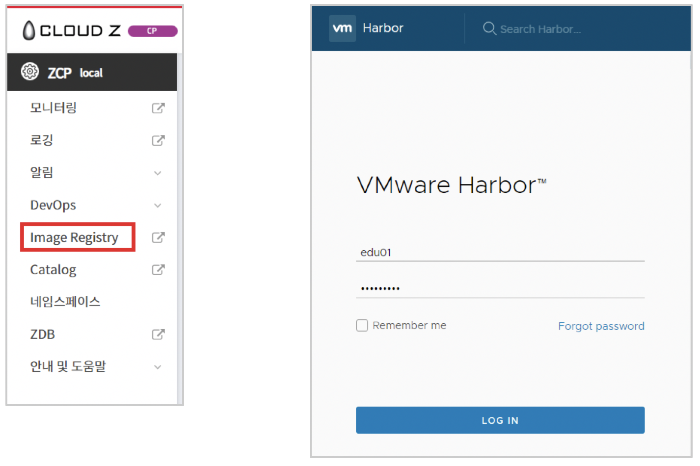
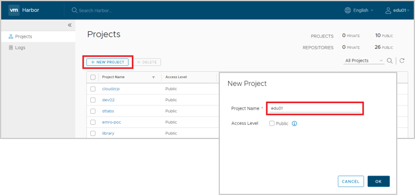
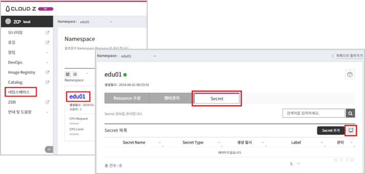
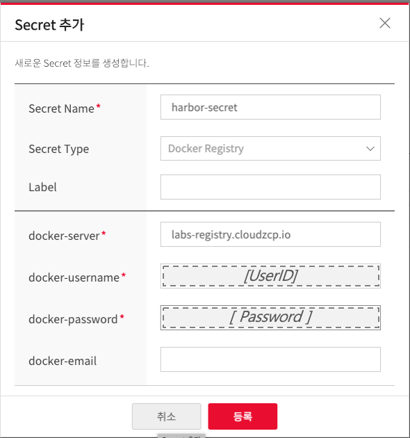
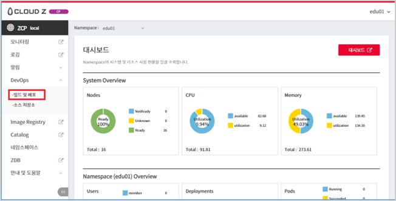
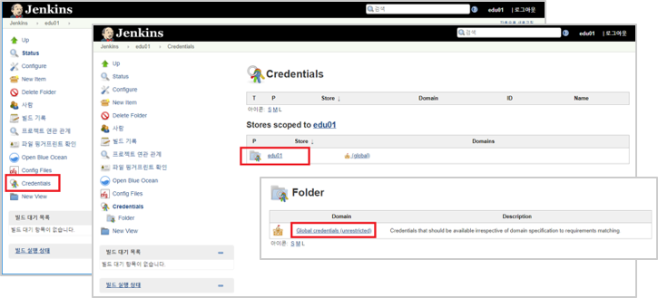
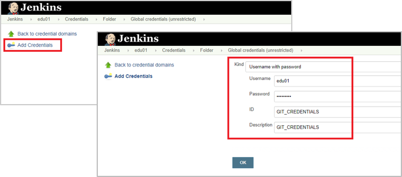
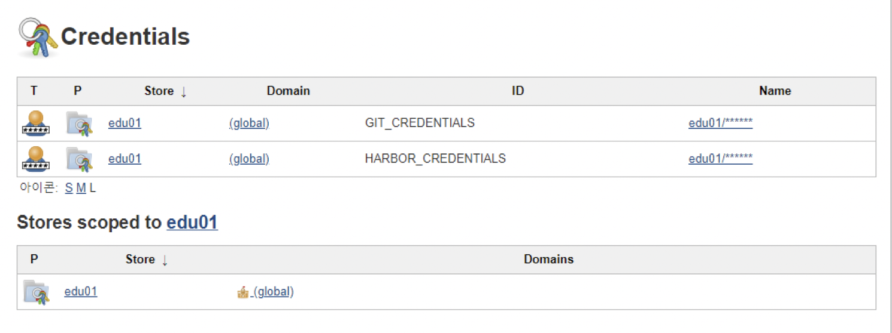

# Step 01 : CI/CD 설정

## Create Harbor Project

1. Left menu > Image Registry 클릭
2. Harbor Login (계정이 없을 경우 생성)

   

3. 좌측 메뉴에서 Projects > NEW PROJECT 클릭
   
4. Project Name 입력 후 OK 클릭 (Project 명은 Docker Image 명의 Namespace 로 사용됨)
   
   

## Create Kubernetes Secret
> K8S Secret  Harbor로부터 Docker Image를 받기위해 필요한 권한 Token임.

1. Left menu > 네임스페이스 > 자신의 namespace Click

2. Secret 탭 선택 > Secret 추가 버튼 클릭

   

3. Secret Name 입력, Secret Type Docker Registry Click

4. Docker-server, docker-username, docker-password, docker-email 입력 후 등록
   
   | Key | Value | Remark |
   | :---: | :--- | :--- |
   | Secret Name | harbor-secret | Deployment.yaml에서 지정된 secret이름과 동일해야함 |
   | Secret Type | Docker Registry | -- |
   | Label | (선택값) | kubernetes의 resource의 label값으로 저장됨 |
   | docker-server | labs-registry.cloudzcp.io | Demo용 주소 |
   | docker-username | *userid* | Demo에 사용되는 Cloudz console ID |
   | docker-password | *passowrd* | Demo에 사용되는 ID의 암호 |
   | docker-email | (선택값) | |
   
   
   

## Set up Jenkins
> Jenkins 에서 빌드/배포가 실행되면서 필요한 권한 설정과, Kubernetes를 위한 Pipeline 작성 법을 설명함.
> Jenkins는  ZCP에서 관리하는 사용자그룹(Namespace)와 권한이 적용됨.
> 사용되는 정보는 User ID = *user01* Namespace = *edu01*

1. Jenkins : Web Console에서, *Devops* > *빌드 및 배포*
   
   

2. Namespace와 동일한 폴더 Click
   
3. Jenmins 왼쪽 메뉴에서  *Credentials* > EDU01(in *Stores scoped to edu01*) > *Global credentilas* Click
   
   

4. 왼쪽 메뉴에서 *Add Credentils* Click
5. Git/Harbor *Username*과 *Password*를 입력함
   * ID: GIT_CREDENTIALS
   * ID: HARBOR_CREDENTIALS
  
   
   
---
[[toc]]