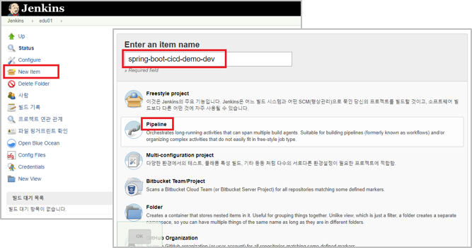

# Step 02 : Pipeline 작성


## Get Sample Application Source
> ZCP Git으로부터 소스를 다운로드함.

1. Open browser and go [github.com/cnpst](https://github.com/cnpst)
2. *Clone or download* > *Download ZIP* click
3. IDE에 Import

   

4. 사용하고자 하는 Git Repositroy에  PUSH


## Create Pipeline
> 사용되는 정보는 User ID : *user01* Namespace : *edu01*
> Application Project Name = *spring-boot-cicd-demo*
> 사용자 Git URL : https://github.com/cnpst/zcp-dev-guide.git

### Development pipeline

1. edu01 폴더  Click
2. 왼쪽메뉴에서 *New Item* Click
3. Inputbox에 **spring-boot-cicd-demo-dev**(jenkins jobname) 입력
4. **Pipeline** 선택

   

5. Pipeline에 필요한 정보 입력: Pipeline section으로 이동(Scroll down)
   * Definition 선택 : *Pipeline script from SCM*
   * SCM 선택: *Git*
   * Repositories
     * Repository URL 입력: *https://github.com/cnpst/zcp-dev-guide.git*
     * Credentials 선택: *edu01/...(GIT CREDENTIALS)*
   * Branch to build 입력 : **/dev*
   * Repository browser 선택 : *gogs*
     * URL 입력: *https://github.com/cnpst/zcp-dev-guide* ( '.git' 제거, browser url )
   * Script Path 입력 : *jenkins-pipeline/deploy-pipeline* ( Git프로젝트 Root Path기준 상대 경로 )
   * 저장
   
   

6. Pipeline script 작성 [Source Link](https://github.com/cnpst/zcp-local-sample/blob/master/Dockerfile)

```groovy
// Jenkins Shared Library 적용
@Library(‘retort-lib’) _
// Jenkins slave pod에 uuid 생성
def label = “Jenkins-${UUID.randomUUID().toString()}”
// Kubernetes cluste에 배포하기 위한 사용자 계정def ZCP_USERID = ‘edu01’
// Docker image 명
def DOCKER_IMAGE = ‘edu01/spring-boot-cicd-demo‘
// 배포 할 Kubernetes namespace
def K8S_NAMESPACE = ‘edu01‘
// Docker Image 의 Tag
def VERSION = ‘develop’

// Pod template 시작
podTemplate(label:label,

    // Kubernetes cluste에 배포하기 위한 secret
    serviceAccount: “zcp-system-sa-${ZCP_USERID}”,

    // 빌드를 실행 할 Jenkins slave pod 환경 구성    
    containers: [        
        containerTemplate(name: ‘maven’, image: ‘maven:3.5.2-jdk-8-alpine’, ttyEnabled: true, command: ‘cat’),       containerTemplate(name: ‘docker’, image: ‘docker’, ttyEnabled: true, command: ‘cat’),        containerTemplate(name: ‘kubectl’, image: ‘lachlanevenson/k8s-kubectl’, ttyEnabled: true, command: ‘cat’)
    ],

    // Pod에 연결할 Volume 설정    
    volumes: [        
        hostPathVolume(hostPath: ‘/var/run/docker.sock’, mountPath: ‘/var/run/docker.sock’),        persistentVolumeClaim(mountPath: '/root/.m2', claimName: ‘zcp-Jenkins-mvn-repo’)    
    ]) {
    node(label) {
        // 소스 코드 Checkout Stage
        stage('SOURCE CHECKOUT') {
            // 소스 코드 Checkout
            // 소스 코드 Repository 의 접속 정보는 Jenkins Pipeline 설정할 때 지정한 정보를 사용함
            def repo = checkout scm
        }
 
        // Maven Build Stage
        stage('BUILD MAVEN') {
            // maven container 동작 수행
            container('maven') {
                // mvn 빌드 수행
                // maven goal은 clean package
                // Local Repository 는 container 내부의 /root/.m2/${JOB_NAME} 을 사용.
                mavenBuild goal: 'clean package', systemProperties:['maven.repo.local':"/root/.m2/${JOB_NAME}"]
            }
        // Docker Build & Push Stage
        stage('BUILD DOCKER IMAGE') {
            // Docker container 에서 동작 수행
            container('docker') {
                // docker build 실행
                // Dockerfile 명, 위치를 별도로 지정하지 않는 경우 소스 코드 root 의 Dockerfile 을 이용해 빌드
                dockerCmd.build tag: ＂${HARBOR_REGISTRY}/${DOCKER_IMAGE}:${VERSION}“
                // Image Registry 에 Docker image push
                dockerCmd.push registry: HARBOR_REGISTRY, imageName: DOCKER_IMAGE, imageVersion: VERSION, credentialsId: ‘HARBOR_CREDENTIALS’
            }
        }
        // Kubernetes 배포 Stage        
        stage('DEPLOY') {
            // kubectl container 에서 동작 수행            
            container('kubectl') {
                // service 생성 또는 업데이트
                kubeCmd.apply file: 'k8s/service.yaml', namespace: K8S_NAMESPACE
                // ingress 생성 또는 업데이트
                kubeCmd.apply file: ‘k8s/ingress.yaml’, namespace: K8S_NAMESPACE
                // deployment 생성 또는 업데이트
                kubeCmd.apply file: ＇k8s/deployment.yaml＇, namespace: K8S_NAMESPACE, wait: 300            
            }
        }    
    }
}
```