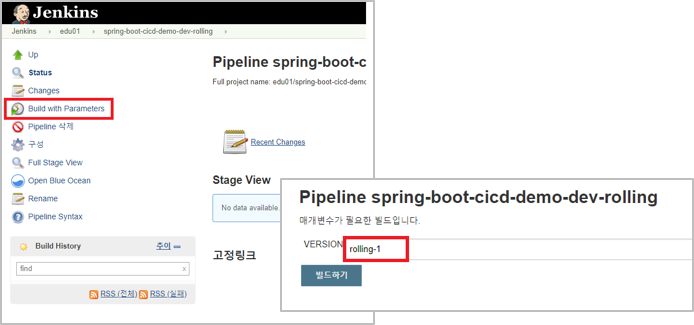
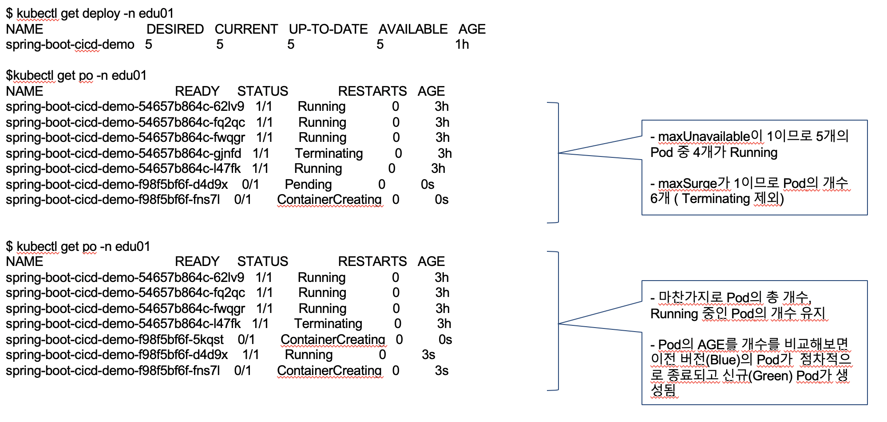
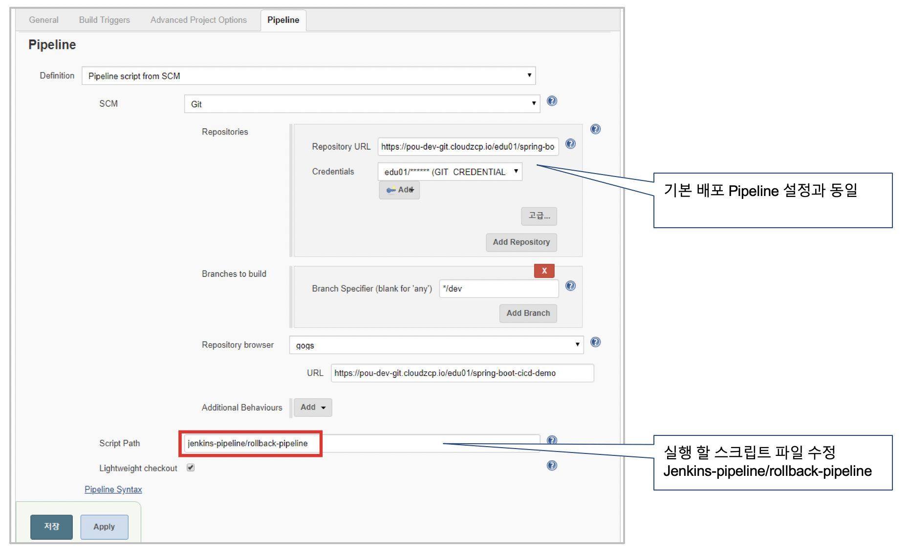
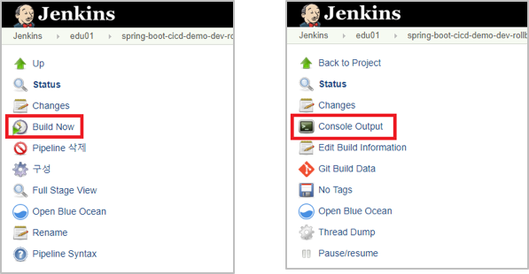

# Step 03 Rolling Update
> Production 운영환경에 배포하는 방법으로 설명. Master branch사용

## Rolling update

#### Deployment 수정

* spec.strategy.type: Rollingupdate  # 배포방식 설정
* spec.strategy.rollingUpdate.maxSurge: 1  # Rolling 단위 설정
* spec.strategy.rollingUpdate.maxUnavailable: 1 # down pod 최소 단위

```yaml
apiVersion: apps/v1
kind: Deployment
metadata:
  name: spring-boot-cicd-demo
  labels:
    app: spring-boot-cicd-demo
spec:
  replicas: 5
  selector:
    matchLabels:
      app: spring-boot-cicd-demo
  strategy:
    type: RollingUpdate
    rollingUpdate:
      maxSurge: 1
      maxUnavailable: 1
....
```

#### Pipeline 작성
spring-boot-cicd-demo-dev-rolling 이름으로 Pipeline작성

[Step 02 Documentation 참조](step02.md)

1. Pipeline 설정에서 Parameter 설정 : VERSION처리를 위해 Pipeline에 변수 추가
2. Genral 영역에서 *이 빌드는 매개변수가 있스빈다.* 체크
3. 매개변수 추가 Click
   1. 매개변수명 : VERSION
   2. Default Value: develop
4. Pipeline 영역
   1. Script Path : Production용 파일로 변경. jenkins-pipeline/rolling-pipeline
5. Git project의 jenkins-pipeline/rolling-pipeline 파일 편집
6. *VERSION* 변수선언 주석 처리

```groovy
// def VERSION = ‘develop’
```
7. Job 설정의 Deploy 변경

```yaml
 yaml.update file: 'k8s/deployment.yaml', update: ['.spec.template.spec.containers[0].image': "${HARBOR_REGISTRY}/${DOCKER_IMAGE}:${VERSION}"]

```

#### Rolling update 실행

1. Click : *Build with Parameters*
2. *VERSION*  입력 : rolling-1
   
   
3. pod 상태 확인 : kubecrl get deploy -n edu01

   

## Rolling rollback

#### Pipeline 설정 
spring-boot-cicd-demo-dev-rollback 이름으로 Pipeline작성

[Step 02 Documentation 참조](step02.md)

1. Script Path 수정 : jenkins-pipeline/rollback-pipeline

    

2. 환경구성 & Volumne은  Deploy 용만 작성
3. Deploy rollback 명령어 작성

```groovy
@Library('retort-lib') _
def label = "jenkins-${UUID.randomUUID().toString()}"
def ZCP_USERID = 'edu01'
def K8S_NAMESPACE = 'edu01'

def TYPE = 'deployment' // Rollback Resource Type: Deployment/Statefulset etc
def DEPLOY_NAME = 'spring-boot-cicd-demo' // Name of resource

podTemplate(label:label,
    serviceAccount: ＂zcp-system-sa-${ZCP_USERID}＂,
    containers: [
        // Kubectl 수행을 위한 kubectl container 만 기동시킴
        containerTemplate(name: 'kubectl', image: 'lachlanevenson/k8s-kubectl', ttyEnabled: true, command: 'cat')
    ]) {

    node(label) {
        stage('ROLLBACK') {
            container('kubectl') {
                // Rollback 수행
                kubeCmd.rolloutUndo type: TYPE, name: DEPLOY_NAME, namespace: K8S_NAMESPACE, wait: 300
            }
        }
    }
}
```

#### Rollback 실행



> Application의 변경된 내용 확인.

---
[[toc]]