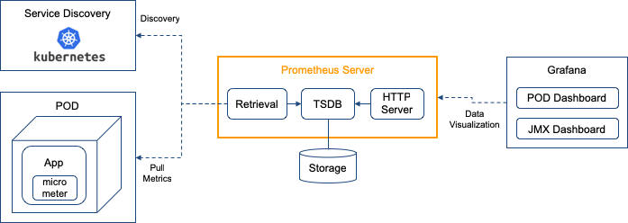
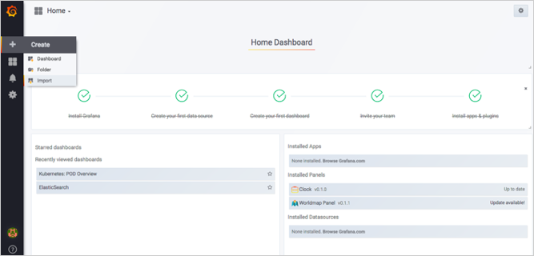
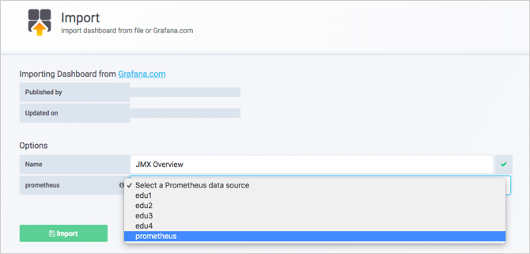
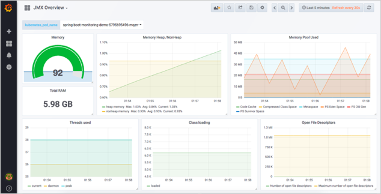
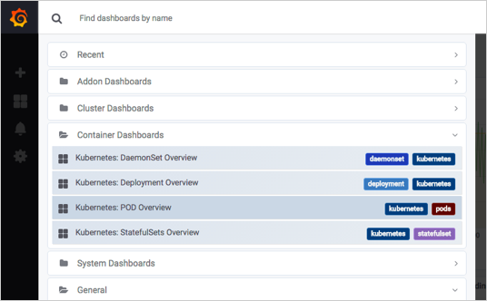

# Monitoring Hands-On
::: tip
* Demo Application 을 Kubernetes cluster에 배포
* Kubernetes로 부터 Micrometer 정보를 discovery
* Target으로 부터 Pod 및 JVM metrics 수집
* Grafana dashboard에서 Pod 및 JVM metrics 정보를 시각화
:::




## Step 1 Application
1. Demo Application 다운로드
   1. `git clone https://github.com/cnpst/sam-zcp-lab`
   2. `cd sam-zcp-lab`
2. Maven Dependency 설정 : micrometer 추가, spring-actuator

```xml
<dependency>
	<groupId>org.springframework.boot</groupId>
	<artifactId>spring-boot-starter-actuator</artifactId>
</dependency>
<!-- Micormeter core dependecy  -->
<dependency>
	<groupId>io.micrometer</groupId>
	<artifactId>micrometer-core</artifactId>
</dependency>
<!-- Micrometer Prometheus registry  -->
<dependency>
	<groupId>io.micrometer</groupId>
	<artifactId>micrometer-registry-prometheus</artifactId>
</dependency>

```
3. springboot(application.yaml) properites 수정
```yaml
#Metrics related configurations
management:
  server:
    port: 8090
  endpoint:
    metrics:
      enabled: true
    prometheus:
      enabled: true
  endpoints:
    web:
      base-path: /
      exposure:
        include: "*"
  metrics:
    export:
      prometheus:
        enabled: true
```
4. maven build
`mvn clean package`

## Step 2 Docker Image

1. Dockerfile 작성
```Dockerfile
FROM openjdk:8-jdk-alpine
ADD target/sample-0.0.1-SNAPSHOT.jar app.jar
ENTRYPOINT ["java","-Djava.security.egd=file:/dev/./urandom",”jar","/app.jar"]
```
2. Docker Image Build
   1. `docker build -t spring-boot-monitoring-demo .`
   2. `docker images`
3. Application 실행/검증
   1. `docker run -p 8080:8080 -p 8090:8090 spring-boot-monitoring-demo`
   2. `curl localhost:8080`
4. Metric 확인 : `curl localhost:8090/prometheus`
5. Docker image Push to Registry
   * `docker tag spring-boot-monitoring-demo:[VERSION] [REPOSITORY_ADDRESS]/spring-boot-monitoring-demo:[VERSION]`
   * `docker push [REPOSITORY_ADDRESS]/spring-boot-monitoring-demo:[VERSION]`

## Step 3 Kubernetes Deploy
1. deployment.yaml
   * spec.template.metadata.annotations.prometheus.io/scrape : Discorvery 대상 여부
   * spec.template.metadata.annotations.prometheus.io/port : Discovery target port
   * spec.template.metadata.annotations.prometheus.io/path : Discovery target path

```yaml
...  
  template:
    metadata:      
...      
      annotations:        
        prometheus.io/scrape: "true"
        prometheus.io/port: "8090"
        prometheus.io/path: /prometheus
      spec:
        containers:
        - name: spring-boot-cicd-demo
          image: cloudzcp/spring-boot-monitoring-demo:latest
...
```
2. Demo Application 배포
   * `kubectl apply -f k8s/deployment.yaml`
3. Metric확인
   * `kubectl port-forward spring-boot-cicd-demo-5795695496-ljfkw 8090:8090`
   * `curl localost:8090`
   * 결과
     * `jvm_memory_used_bytes{area="heap",id="PS Survivor Space",} 4390912.0`
     * `jvm_memory_used_bytes{area="heap",id="PS Old Gen",} 1.6629768E7`

## Step 4 Dashboard 구성
1. Import 메뉴 Click



2. *Upload .json File* Click
3. 다운로드 받은 sam-zcp-lab 프로젝트 > grafana > micrometer-grafana-dashboard.json 파일 import
4. Options > prometheus combo box > prometheus data source 선택 > `Import` 버튼 선택 



5. Heap Memory, Threads, Class Loading, Open File, GC 등에 대한 metrics을 그래프 형태로 조회
   
   

6. 기타 Dashboard
   
   

---
[[toc]]